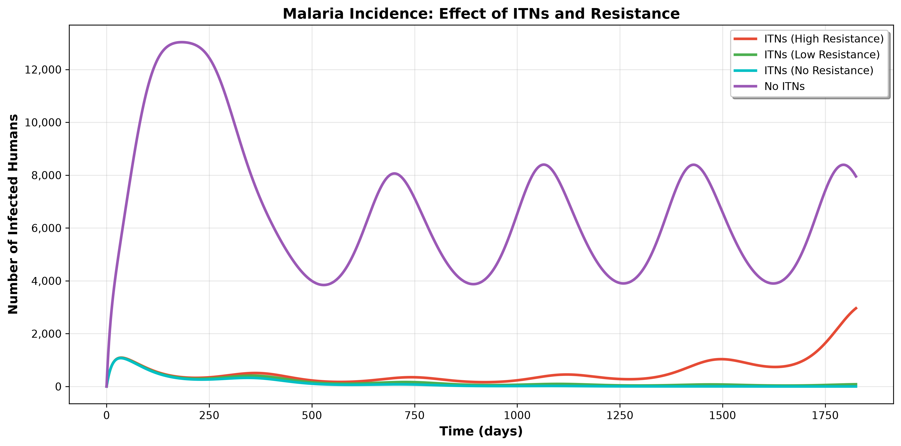
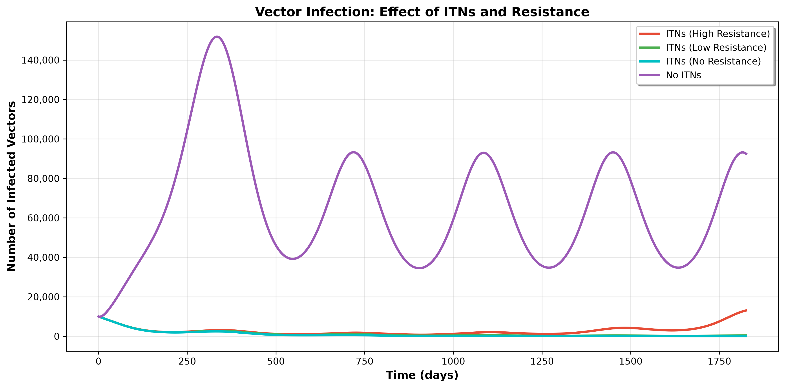
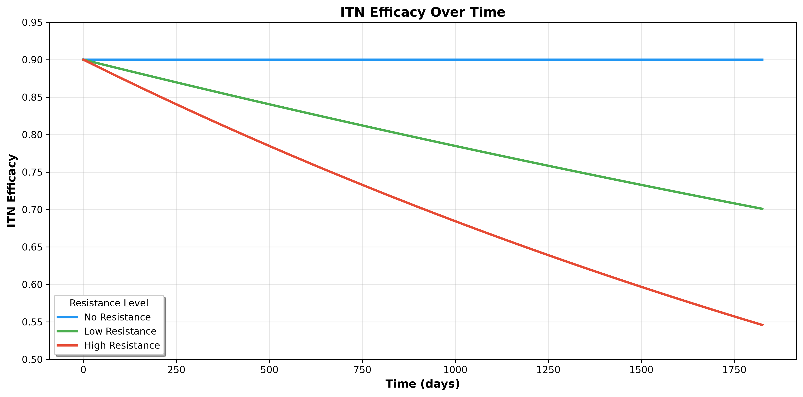
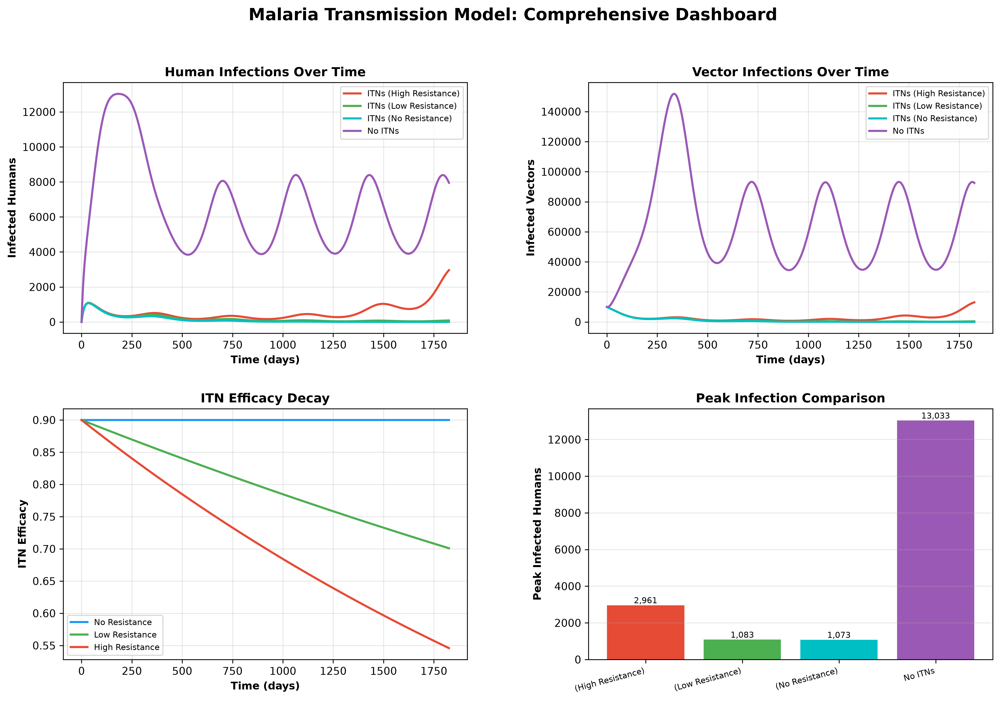

# Malaria Transmission Model in Madagascar

[](https://opensource.org/licenses/MIT)
[](https://www.python.org/downloads/)
[](https://www.r-project.org/)

A comprehensive epidemiological modeling study examining the effectiveness of Insecticide-Treated Nets (ITNs) in malaria control programs in Madagascar with particular focus on the impact of insecticide resistance over time.

## 📋 Table of Contents

- [Overview](#overview)
- [Features](#features)
- [Installation](#installation)
- [Quick Start](#quick-start)
- [Project Structure](#project-structure)
- [Usage](#usage)
  - [Python](#python)
  - [R](#r)
  - [Jupyter Notebook](#jupyter-notebook)
- [Model Description](#model-description)
- [Results](#results)
- [Visualizations](#visualizations)
- [Documentation](#documentation)
- [Contributing](#contributing)
- [Citation](#citation)
- [Authors](#authors)
- [License](#license)
- [Acknowledgments](#acknowledgments)
- [References](#references)

## 🎯 Overview

This project implements a modified SIR (Susceptible-Infected-Recovered) epidemiological model to simulate malaria transmission dynamics in Madagascar. The model incorporates:

- **Human population dynamics** (S, I, R compartments)
- **Vector population dynamics** (S, I compartments)
- **ITN effects** with time-dependent efficacy
- **Insecticide resistance** modeling
- **Seasonal variation** in vector mortality

### Research Question

> *How does insecticide resistance affect the long-term effectiveness of Insecticide-Treated Nets (ITNs) in malaria control programs in Madagascar?*

## ✨ Features

### Multiple Implementation Options
- 🐍 **Python**: Complete object-oriented implementation with visualization tools
- 📊 **R**: Statistical analysis with tidyverse and deSolve
- 📓 **Jupyter Notebook**: Interactive analysis and documentation

### Comprehensive Analysis
- **Four Simulation Scenarios:**
  - No ITNs (baseline)
  - ITNs with no resistance
  - ITNs with low resistance (5%/year)
  - ITNs with high resistance (10%/year)

- **Advanced Features:**
  - Population dynamics simulation over 5 years
  - ITN efficacy degradation modeling
  - Statistical comparison of scenarios
  - Model validation and sensitivity analysis
  - Professional visualizations and reports

## 🚀 Installation

### Prerequisites

**For Python:**
- Python 3.8 or higher
- pip package manager

**For R:**
- R 4.0 or higher
- RStudio (recommended)

### Quick Setup

#### 1. Clone the Repository

```bash
git clone https://github.com/Nana-Safo-Duker/Malaria-Transmission-Model-Madagascar.git
cd Malaria-Transmission-Model-Madagascar
```

#### 2. Python Setup

```bash
# Create virtual environment (recommended)
python -m venv venv

# Activate virtual environment
# On Windows:
venv\Scripts\activate
# On macOS/Linux:
source venv/bin/activate

# Install dependencies
pip install -r requirements.txt
```

#### 3. R Setup

```r
# Install required packages
install.packages(c(
  "tidyverse",
  "deSolve",
  "ggplot2",
  "dplyr",
  "knitr"
))
```

## 🎬 Quick Start

### Python

```bash
# Run the complete analysis
python main.py
```

This will:
- Run all four simulation scenarios
- Generate visualizations
- Create summary statistics
- Save results to `output/` directory

### R

```r
# Run the R script
source("scripts/Malaria-Transmission-Model-Madagascar.r")
```

### Jupyter Notebook

```bash
# Start Jupyter
jupyter notebook

# Open the notebook
# notebooks/Malaria-Transmission-Model-Madagascar.ipynb
```

## 📁 Project Structure

```
Malaria-Transmission-Model-Madagascar/
├── README.md                          # This file
├── LICENSE                            # MIT License
├── requirements.txt                   # Python dependencies
├── .gitignore                        # Git ignore rules
├── main.py                           # Main Python execution script
│
├── src/                              # Python source code
│   ├── __init__.py                   # Package initialization
│   ├── malaria_model.py              # Core model implementation
│   ├── visualization.py              # Plotting and visualization
│   └── utils.py                      # Utility functions
│
├── scripts/                          # R and other scripts
│   └── Malaria-Transmission-Model-Madagascar.r
│
├── notebooks/                        # Jupyter notebooks
│   └── Malaria-Transmission-Model-Madagascar.ipynb
│
├── data/                             # Data directory
│   └── README.md                     # Data documentation
│
├── output/                           # Generated outputs
│   └── README.md                     # Output documentation
│
├── docs/                             # Documentation
│   └── model_description.md          # Detailed model docs
│
└── tests/                            # Unit tests
    └── test_malaria_model.py         # Model tests
```

## 💻 Usage

### Python API

```python
from src.malaria_model import MalariaModel, ModelParameters
from src.visualization import MalariaVisualizer
from src.utils import SimulationResults, calculate_summary_statistics

# Initialize model with custom parameters
params = ModelParameters(
    R0=2.0,
    infectious_period=14.0,
    itn_coverage=0.8,
    itn_efficacy=0.9,
    resistance_rate=0.1,
    human_population=200000,
    simulation_days=365 * 5
)

# Create and run model
model = MalariaModel(params)
scenarios = model.run_multiple_scenarios()

# Calculate statistics
summary = calculate_summary_statistics(scenarios)

# Visualize results
visualizer = MalariaVisualizer()
time_points = np.arange(0, params.simulation_days + 1, 1)
visualizer.save_all_plots(scenarios, time_points)
```

### Customizing Parameters

#### Python
```python
# Example: Change ITN coverage
params = ModelParameters(itn_coverage=0.9)  # 90% coverage

# Example: Adjust resistance rate
params = ModelParameters(resistance_rate=0.15)  # 15% per year
```

#### R
```r
# Example: Change ITN coverage
itn_coverage <- 0.9  # 90% coverage

# Example: Adjust resistance rate
resistance_rate <- 0.15  # 15% per year
```

## 🧮 Model Description

### Mathematical Formulation

The model consists of five differential equations:

**Human Compartments:**
```
dSh/dt = -βv→h Sh (Nv/Nh) (Iv/Nv) (1/4) + α Rh
dIh/dt = βv→h Sh (Nv/Nh) (Iv/Nv) (1/4) - γh Ih
dRh/dt = γh Ih - α Rh
```

**Vector Compartments:**
```
dSv/dt = r Nv (1 - Nv/K) - βh→v Sv (Ih/Nh) (1/4) - (1 + sin(2πt/365))/5 d Sv
dIv/dt = βh→v Sv (Ih/Nh) (1/4) - (1 + sin(2πt/365))/5 d Iv
```

**ITN Effectiveness Decay:**
```
E(t) = E₀ exp(-r_res × t/365)
```

### Key Parameters

| Parameter | Value | Description |
|-----------|-------|-------------|
| R₀ | 2.0 | Basic reproduction number |
| Infectious Period | 14 days | Average duration of malaria infection |
| ITN Coverage | 80% | Population coverage of ITNs |
| Initial ITN Efficacy | 90% | Initial effectiveness of ITNs |
| Resistance Rate | 10%/year | Annual rate of resistance development |

For detailed model documentation, see [docs/model_description.md](docs/model_description.md).

## 📈 Results

### Key Findings

1. **ITN Effectiveness**: ITNs provide significant malaria reduction even with resistance (77-92% reduction in peak infections across scenarios)
2. **Resistance Impact**: High resistance reduces peak-reduction effectiveness by ~14-15 percentage points (from ~92% with no resistance to ~77% with high resistance)
3. **Long-term Efficacy**: After 5 years, ITN efficacy drops to ~55% with high resistance
4. **Policy Implications**: ITNs remain highly cost-effective even with high resistance, though continued monitoring and resistance-management strategies are recommended

### Sample Output

Values below are the actual results reproduced by running `python main.py` with the default parameters (`R0=2.0`, `itn_coverage=0.8`, `itn_efficacy=0.9`, `resistance_rate=0.1`, `human_population=200000`, 5-year simulation).

| Scenario | Peak Infected Humans | Peak Reduction (%) | Mean Infected Humans |
|----------|---------------------|---------------|---------------------|
| No ITNs | 13,033 | - | 6,710 |
| ITNs (No Resistance) | 1,074 | 91.8% | 129 |
| ITNs (Low Resistance) | 1,083 | 91.7% | 182 |
| ITNs (High Resistance) | 2,962 | 77.3% | 557 |

### Visualizations

Generated by running `python main.py` (see [`output/`](output/) for the full-resolution files):

**Human infection dynamics across all four scenarios:**



**Vector (mosquito) infection dynamics across all four scenarios:**



**ITN efficacy decay driven by insecticide resistance:**



**Comprehensive dashboard combining all key metrics:**



### Generated Files

Running the simulation creates:

**Data Files:**
- `malaria_simulation_results.csv` - Complete time series data
- `malaria_summary_statistics.csv` - Summary statistics
- `model_parameters.json` - Model configuration

**Visualizations:**
- `human_infections.png` - Human infection dynamics
- `vector_infections.png` - Vector infection dynamics
- `itn_efficacy.png` - ITN efficacy decay
- `comprehensive_dashboard.png` - Combined dashboard

**Reports:**
- `analysis_report.txt` - Detailed findings and recommendations

## 📚 Documentation

- **[Model Description](docs/model_description.md)**: Detailed mathematical formulation and assumptions
- **[Data Directory](data/README.md)**: Information about data files and formats
- **[Output Directory](output/README.md)**: Description of generated outputs

### API Documentation

```python
# Generate API documentation
python -m pydoc src.malaria_model
python -m pydoc src.visualization
python -m pydoc src.utils
```

## 🧪 Testing

```bash
# Run tests (Python)
pytest tests/

# Run specific test
pytest tests/test_malaria_model.py -v
```

## 🤝 Contributing

We welcome contributions! Please follow these steps:

1. Fork the repository
2. Create a feature branch (`git checkout -b feature/amazing-feature`)
3. Commit your changes (`git commit -m 'Add amazing feature'`)
4. Push to the branch (`git push origin feature/amazing-feature`)
5. Open a Pull Request

### Development Guidelines

- Follow PEP 8 for Python code
- Follow R style guidelines for R code
- Add docstrings for all functions
- Include unit tests for new features
- Update documentation as needed

## 📄 License

This project is licensed under the MIT License - see the [LICENSE](LICENSE) file for details.

## 📚 Citation

If you use this model in your research, please cite:

```bibtex
@software{malaria-transmission-model-madagascar,
  title={Malaria Transmission Model in Madagascar: ITN Effectiveness and Resistance},
  author={Diop, Mouhamadou Fadel and Anane, Agnes Achiamaa and Maina, Grace Njoki and Duker, Nana Safo},
  year={2025},
  url={https://github.com/Nana-Safo-Duker/Malaria-Transmission-Model-Madagascar},
  note={Epidemiological modeling of malaria transmission with ITN effects}
}
```

**APA Format:**

Safo, M. F., Anane, A. A., Maina, G. N., & Duker, N. S. (2025). *Malaria Transmission Model: Simulation and Resistance Analysis in Madagascar* (Version 1.1.0). GitHub. https://github.com/Nana-Safo-Duker/Malaria-Transmission-Model-Madagascar

**Related Publication:**

Medium Article: [Simulating and Fitting Malaria Transmission Model in Madagascar](https://medium.com/@freshsafoduker300/simulating-and-fitting-malaria-transmission-model-in-madagascar-impact-of-insecticide-treated-nets-fd9c10d4cda4)

## 👥 Authors

**Safo et al. (2025)**

- **Nana Safo Duker** - *Lead Author*
- **Mouhamadou Fadel Diop**
- **Agnes Achiamaa Anane**
- **Grace Njoki Maina**

## 📞 Contact

- **Author**: Nana Safo Duker
- **Email**: freshsafoduker3@gmail.com
- **GitHub**: [@Nana-Safo-Duker](https://github.com/Nana-Safo-Duker)
- **Project Link**: [https://github.com/Nana-Safo-Duker/Malaria-Transmission-Model-Madagascar](https://github.com/Nana-Safo-Duker/Malaria-Transmission-Model-Madagascar)

## 🙏 Acknowledgments

This work was conducted as part of the **Disease Modelling for Pandemic Preparedness and Response Modular Certificate Course** under the **German-West African Centre for Global Health and Pandemic Prevention (G-WAC)** at **Kwame Nkrumah University of Science and Technology (KNUST)**, Kumasi, Ghana.

We gratefully acknowledge:
- G-WAC and its partners for support and collaborative environment
- Madagascar Ministry of Health for epidemiological data
- WHO Global Malaria Programme for ITN effectiveness guidelines
- R and Python communities for excellent scientific computing packages

## 📖 References

1. World Health Organization. (2023). *World Malaria Report 2023*. Geneva: WHO.

2. Bhatt, S., et al. (2015). The effect of malaria control on Plasmodium falciparum in Africa between 2000 and 2015. *Nature*, 526(7572), 207-211.

3. Ranson, H., et al. (2016). Insecticide resistance in African Anopheles mosquitoes: a worsening situation that needs urgent action. *Trends in Parasitology*, 32(3), 187-196.

4. Griffin, J.T., et al. (2010). Reducing Plasmodium falciparum malaria transmission in Africa: a model-based evaluation of intervention strategies. *PLoS Medicine*, 7(8), e1000324.

5. Smith, D.L., et al. (2007). Ross, Macdonald, and a theory for the dynamics and control of mosquito-transmitted pathogens. *PLoS Pathogens*, 3(4), e45.

## 📝 Changelog

### Version 1.1.0 — October 2025

**Status**: Active Development

**Updates:**
- 🐍 Added comprehensive Python implementation with OOP design
- 📊 Enhanced R script with improved documentation
- 📓 Improved Jupyter Notebook with detailed explanations
- 🎨 Advanced visualization tools with multiple plot types
- 📁 Organized project structure with proper directories
- 📚 Comprehensive documentation and API reference
- ✅ Added unit tests and validation checks
- 🔧 Utility functions for analysis and reporting

### Previous Version

**Version 1.0.0 — September 2025**
- 🔰 Initial release featuring deterministic malaria model
- 📈 Basic ITN resistance simulations
- 📊 R-based implementation

---

**Made with ❤️ for malaria research and public health**

**Last Updated**: August 2025
